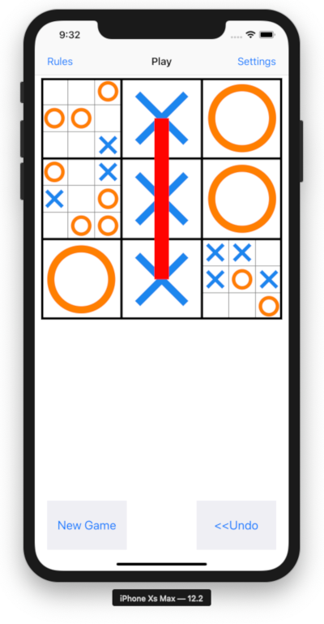
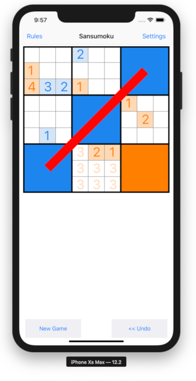

# TicTacToe Ultimatum

An iOS app in Swift implementing the classic game of Ultimate Tic Tac Toe.

This is my first attempt at developing an iOS app. It's pretty bad. I'm not really interested in maintaining it, so I have removed it from the App Store. Its official successor is [Sansumoku](https://github.com/mkhrapov/sansumoku).

If you like Ultimate Tic-Tac-Toe, you may also be interested in my new
original game, Sansumoku. It is a mash-up of Ultimate Tic-Tac-Toe and Sudoku.
It is much harder than Ultimate Tic-Tac-Toe and requires very strong
analytical abilities.

[Sansumoku website](https://www.sansumoku.com)

[Sansumoku on the AppStore](https://apps.apple.com/app/id1458250030)

